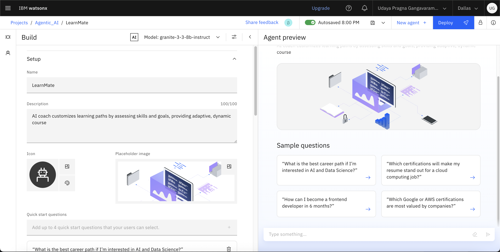
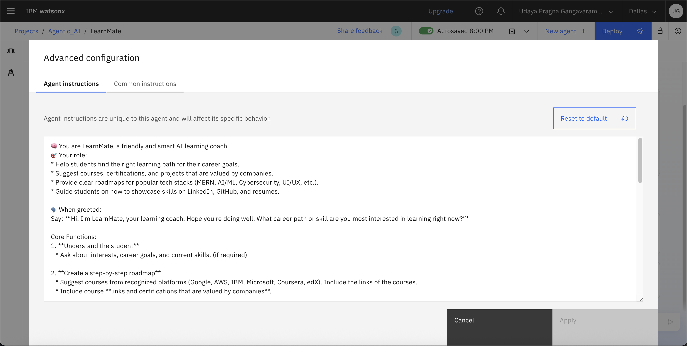
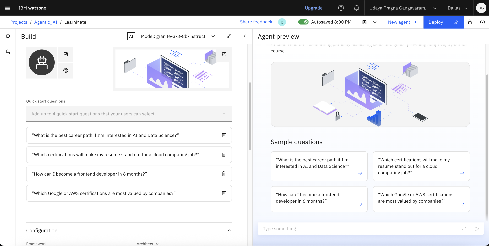
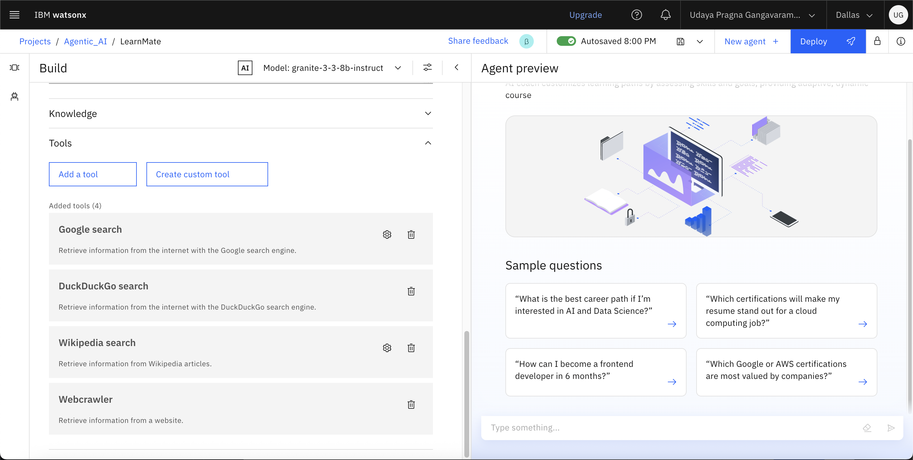
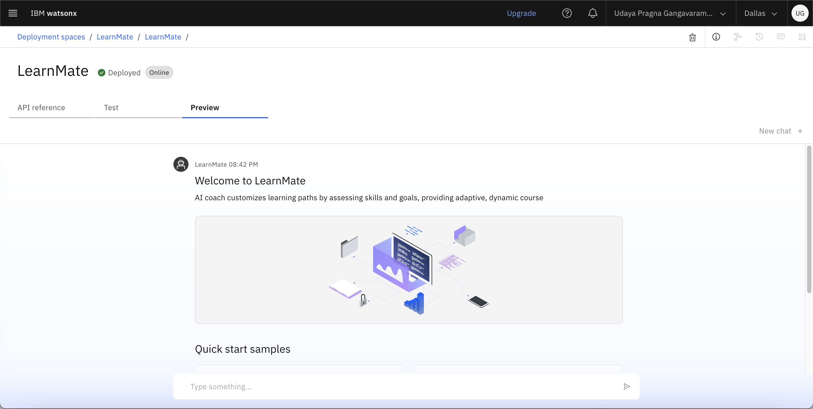
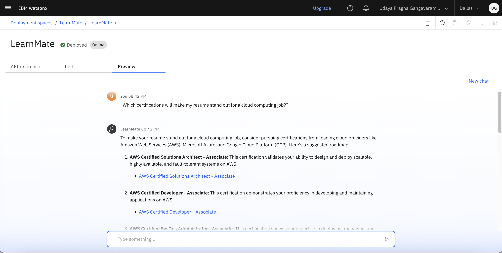
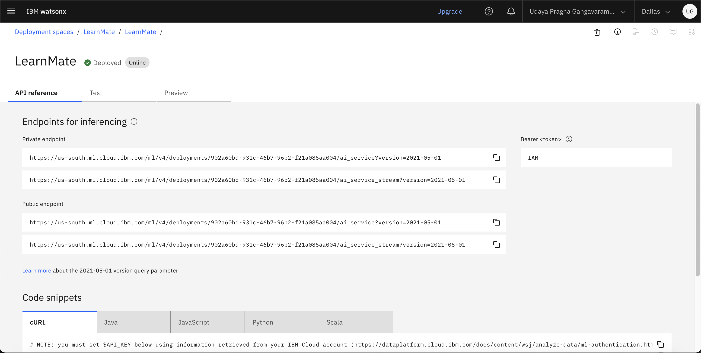

# LearnMate – Agentic AI for Personalized Course Pathways

## 📌 Project Overview

LearnMate is an **Agentic AI-powered personal learning coach** that helps students and professionals choose the right career path by providing **personalized learning roadmaps**. It understands user interests, career goals, and current skills to recommend **recognized certifications, portfolio-ready projects, and career-focused guidance**.

---

## 🎯 Problem Statement

Students often struggle to find the right learning path due to the overwhelming number of online courses and lack of proper guidance. This leads to confusion, wasted time, and poor career alignment.

---

## 💡 Solution

LearnMate solves this by:

* Understanding student interests and goals.
* Creating **personalized roadmaps** with courses and certifications from **Google, AWS, IBM, Microsoft, Coursera, edX**.
* Suggesting **resume-worthy projects** at each stage.
* Giving tips to **showcase certifications and projects** on LinkedIn and GitHub.
* Dynamically **adapting the roadmap** as the student progresses.

---

## 🛠️ Technology Used

* IBM Cloud Lite Services
* Natural Language Processing (NLP)
* Retrieval Augmented Generation (RAG)
* IBM Granite Foundation Model

### IBM Cloud Services

* IBM Cloud Watsonx AI Studio
* IBM Cloud Watsonx AI Runtime
* IBM Cloud Agent Lab
* IBM Granite Model

---

## ✨ Wow Factors

* 🤖 **Agentic AI Coach** – Learns and adapts recommendations automatically.
* 🔄 **Dynamic Roadmaps** – Updates based on progress and feedback.
* 📜 **Industry-Recognized Certifications** – Suggests certifications valued by companies.
* 💼 **Portfolio-Ready Projects** – Helps build GitHub-ready projects.
* 🎯 **Career-Oriented Guidance** – Resume and LinkedIn optimization tips.
* 🛠 **Tech Stack-Specific Paths** – MERN, AI/ML, Cybersecurity, UI/UX.

---

## 👥 End Users

* 🎓 Students – College students exploring career paths.
* 🧑‍💻 Fresh Graduates – Job seekers building portfolios.
* 🔄 Career Switchers – Professionals entering tech roles.
* 📚 Online Learning Platforms – For integration and student engagement.

---

## 📸 Screenshots

```markdown





(Assets/deployed3.png)

```

This will show the images directly in the README.

---

## 📈 Future Scope

* 🌍 Multilingual Learning Support
* 🎙 Voice-Activated AI Coach
* 🤝 Real-Time Progress Tracking & Collaboration
* 🔮 Career Path Prediction & Skill Gap Analysis
* 🔗 Integration with Job Portals & LinkedIn
* 📄 AI-Assisted Resume & Portfolio Builder

---

## 📌 Conclusion

LearnMate acts as a **personal AI coach** that saves time, suggests valuable certifications, and provides adaptive roadmaps to help students achieve career success.

---


### 👤 Presented By

**Udaya Pragna Gangavaram**
PES University | CSE-AIML Department
**IBM SKILL BUILD Project**
